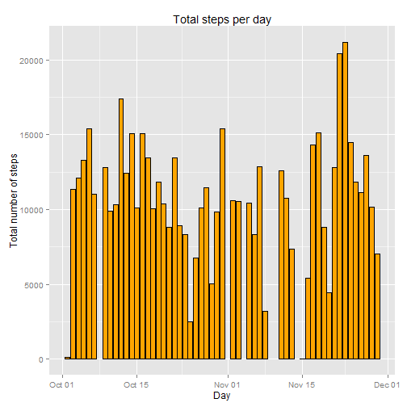
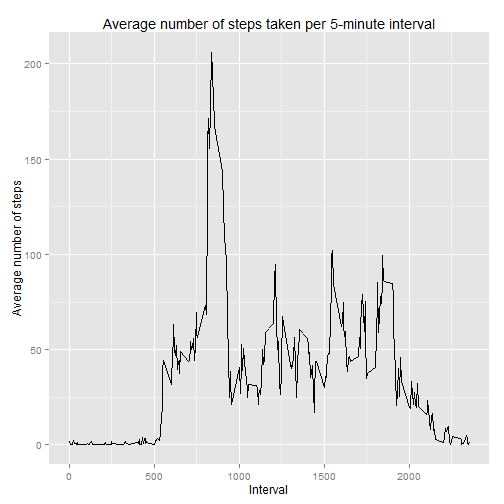
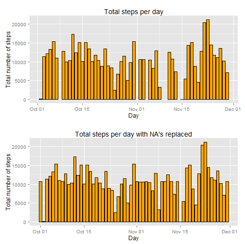
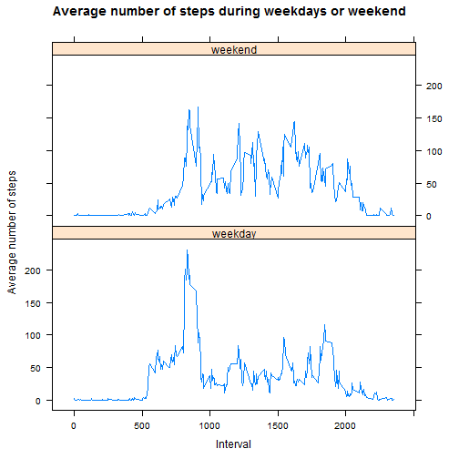

# Introduction
The assigment will use data from personal activity monitoring device. The data consists of 2 months of data collected during October and Nomvember 2012 and include the number of steps taken in 5 minutes interval. 

# Reproducible Research : Peer Assessments 1  

## Loading and preprocessing the data
To start the analysis we need to load the data using read.csv and loading the required libraries. 


```r
setwd("~/a_MOOC/Coursera classes/Reproducible Research")

library(dplyr)
library(ggplot2)
df <- read.csv("activity.csv", colClasses = c(steps = "integer", date = "Date", 
      interval = "integer"), stringsAsFactors = FALSE)
```

# What is the mean of the total number of steps taken per day?
I like dplyr, so I will group the data by date and then calculate the sum of steps per day and call that new value by total.steps.


```r
total.steps.per.day <- df %>% 
                       group_by(date) %>% 
                       summarise(total.steps = sum(steps))
```
##Creating an histogram of the total number of steps taken each day.


```r
ggplot(total.steps.per.day, aes(x = date, y = total.steps)) +
        geom_histogram(stat = "identity", color = "black", fill = "orange") +
        labs(title = "Total steps per day", x = "Day", y = "Total number of steps")
```

```
## Warning in loop_apply(n, do.ply): Removed 8 rows containing missing values
## (position_stack).
```

 
##Calculating the mean and median of the total number of steps taken per day and ignoring the na's values. 

```r
mean.of.steps.per.day <- mean(total.steps.per.day$total.steps, na.rm= TRUE)
median.of.steps.per.day <- median(total.steps.per.day$total.steps, na.rm= TRUE)
mean.of.steps.per.day
```

```
## [1] 10766.19
```

```r
median.of.steps.per.day
```

```
## [1] 10765
```
#What is the average daily activity pattern?

##We will make a time series plot of the 5 minute interval and the average number of steps taken.  
First I will group the data by interval and then calculate the mean per interval. 

```r
mean.steps.per.interval <- df %>% 
        group_by(interval) %>% 
        summarise(average.steps.interval = mean(steps, na.rm = TRUE))
```
##Now, lets create the plot.

```r
ggplot(mean.steps.per.interval, aes(interval, average.steps.interval)) +
        geom_line() +
        labs(title = "Average number of steps taken per 5-minute interval", x = "Interval",         y = "Average number of steps")
```

 
##Lets find the interval that contains the maximum number of steps on average.

```r
interval_max <- subset(mean.steps.per.interval$interval,
                mean.steps.per.interval$average.steps.interval==
                max(mean.steps.per.interval$average.steps.interval))
interval_max
```

```
## [1] 835
```

#Imputing missing values

##How many NA's in the dataset?
Different method, same result.

```r
sum(!complete.cases(df))
```

```
## [1] 2304
```

```r
sum(is.na(df))
```

```
## [1] 2304
```
We will replace the NA's with the mean of the interval. Lets run a loop to replace these pesky NA's and also creating a new dataset in the process.

```r
new.df <- df
    for (i in 1:nrow(new.df)) {
    if(is.na(new.df$steps[i])) {
        new.df$steps[i] <-mean.steps.per.interval[which(new.df$interval[i] ==                       mean.steps.per.interval$interval), ]$average.steps.interval
    }
}
```


```r
new.total.steps.per.day <- new.df %>% 
                       group_by(date) %>% 
                       summarise(total.steps = sum(steps))
```

Lets make a plot to see if there is an impact with the replacment.


```r
library(gridExtra)
plot1 <- ggplot(total.steps.per.day, aes(date, total.steps)) +
         geom_histogram(stat = "identity", color = "black", fill = "orange") +
         labs(title = "Total steps per day", x = "Day", y = "Total number of steps")
plot2 <- ggplot(new.total.steps.per.day, aes(date, total.steps)) +
        geom_histogram(stat = "identity", color = "black", fill = "orange") +
        labs(title = "Total steps per day with NA's replaced", x = "Day", 
        y = "Total number of steps")
grid.arrange(plot1, plot2)
```

```
## Warning in loop_apply(n, do.ply): Removed 8 rows containing missing values
## (position_stack).
```

 


```r
new.mean.of.steps.per.day <- mean(new.total.steps.per.day$total.steps, na.rm= TRUE)
new.median.of.steps.per.day <- median(new.total.steps.per.day$total.steps, na.rm= TRUE)
new.mean.of.steps.per.day
```

```
## [1] 10766.19
```

```r
new.median.of.steps.per.day
```

```
## [1] 10766.19
```

We can see that by replacing NA's values with the interval mean we fill the plot with somewhat logical values!? But it do not change the other values otherwise, except
now we see that the mean and the median are identical! Strange, to be explore further...

#Are there differences in activity patterns between weekdays and weekends?


```r
new.df$day <- weekdays(new.df$date)
new.df$day <- weekdays(new.df$date)
for (i in 1:nrow(new.df)) {
    if(new.df$day[i] %in% c("Monday", "Tuesday", "Wednesday", "Thursday", "Friday")) 
        new.df$level[i] <- "weekday"
    else
        new.df$level[i] <- "weekend"
}
new.df$level <- as.factor(new.df$level)
```

Lets make a plot to see the comparison between weekdays and weekend.


```r
new.mean.steps.per.interval <- aggregate(steps ~ interval + level, data = new.df, mean)
library(lattice)
xyplot(new.mean.steps.per.interval$steps ~ new.mean.steps.per.interval$interval | new.mean.steps.per.interval$level, layout=c(1,2), 
       type="l", main="Average number of steps during weekdays or weekend", 
       xlab="Interval", ylab="Average number of steps")
```

 

We can see that during the weekend, there is more activities during midday.
